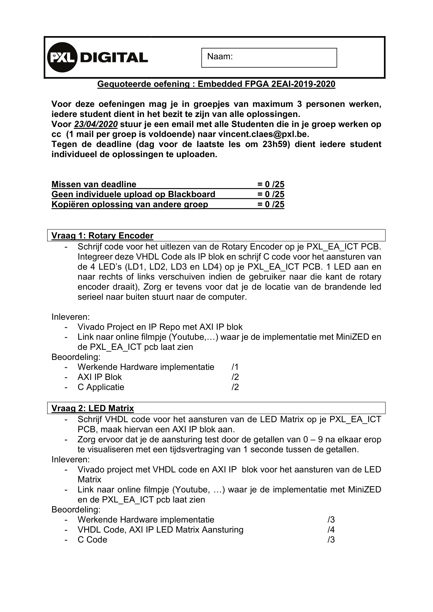

## extra information

### eerste oefening:
rotary encoder van de EAICTPCB gebruiken  
vhdl code schrijven  
AXI IP blok van maken  
aan je processor hangen  
en dan de 4 LED's aansturen  
1 LED aanzetten  
als de gebruiker naar rechts draait  
gaat het LEDje rechts van de LED die aan was aan  
locatie van de brandende leds is welke led aan is  
